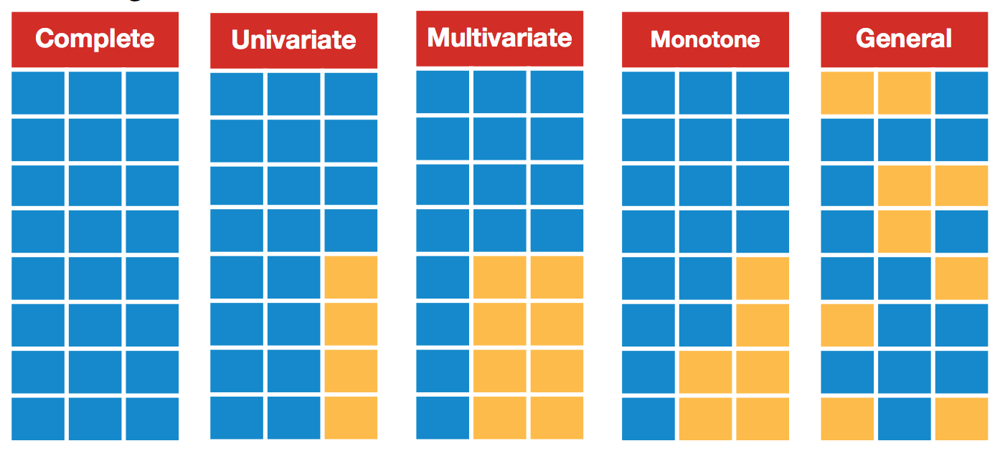
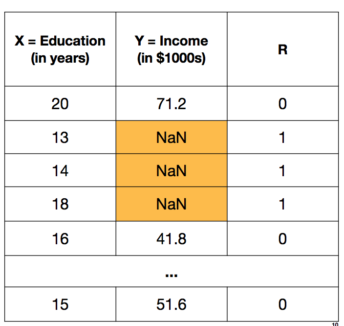
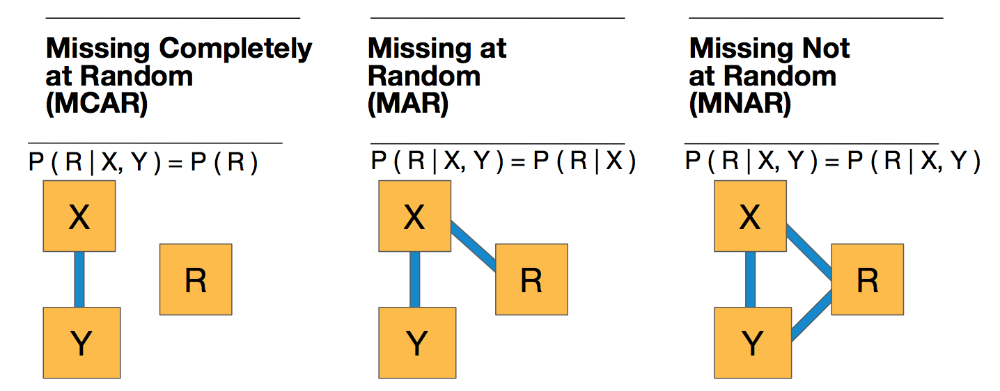

# Simulating Techniques with Missing Data

## Description
Missing data is a common issue in many datasets. If not handled properly, missing data can result in biased estimations and/or loss of power. I explore the different missingness mechanisms and several different techniques to deal with missing data including ad hoc methods, multiple imputation, and maximum likelihood. I use a simulation approach to uncover how each of these techniques compare to analysis with a complete dataset as well as their limitations. 

## Motivation

## Background

### Missing Data Patterns
There are many missing data patterns.  Below illustrates a few patterns that may appear in a dataset.

### Missing Mechanisms
The missing data may occur in one of three ways: Missing Completely at Random (MCAR), Missing at Random (MAR), or Missing Not at Random (MNAR).  It is important to consider which missingness mechanism is at play, prior to applying a missing data technique.

Consider the below dataset where Education and Income was collected.  Education is the fully observed in the dataset (X), Income has some missing values in the dataset (Y), and R is a missing data indicator.

The missigness mechanism is based on the way X, Y, and R are related.

