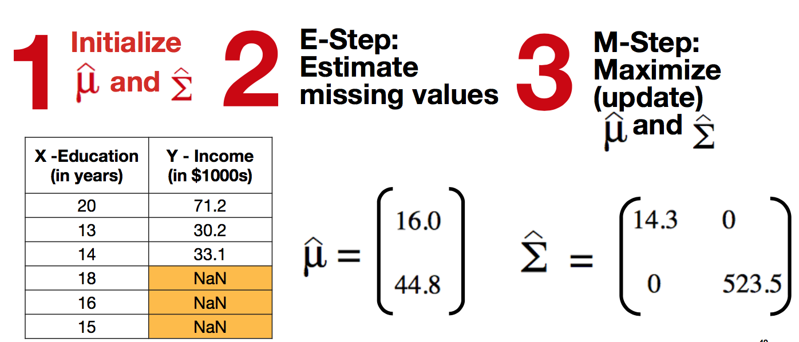

# Evaluating Missing Data Techniques through Simulation

## Description
Missing data is a common issue in many datasets. If not handled properly, missing data can result in biased estimations and/or loss of power. I explore the different missingness mechanisms and several different techniques to deal with missing data including ad hoc methods, multiple imputation, and maximum likelihood. I use a simulation approach to uncover how each of these techniques compare to analysis with a complete dataset as well as their limitations. 

## Motivation
We are surrounded by data, and the insights that can be drawn from data using statistical and machine learning techniques are powerful.  An initial step in data analysis is to clean the data to ensure the it is of good quality so that sound conclusions can be drawn from the analysis.  A Forbes article reported that 60% of a Data Scientist's time is spent cleaning and organizing data.  Part of the cleaning stage includes addressing missing data.  Without propery handling missing data, results may be unreliable and biased.

The topic of missing data and techniques to address it is widely studied.  To dive deep in the understanding of the effectiveness of these missing data using a simulation approach.

## Background

### Missing Data Patterns
There are many missing data patterns.  Below illustrates a few patterns that may appear in a dataset.

  

### Missing Mechanisms
The missing data may occur in one of three ways: Missing Completely at Random (MCAR), Missing at Random (MAR), or Missing Not at Random (MNAR).  It is important to consider which missingness mechanism is at play, prior to applying a missing data technique.

Consider the below dataset where Education and Income was collected.  Education is the fully observed in the dataset (X), Income has some missing values in the dataset (Y), and R is a missing data indicator.

  

The missigness mechanism is based on the way X, Y, and R are related, as illustrated in the figure below (the blue line indicates a relationship).  For example, if people with higher incomes tend to not report their income, MNAR would apply because the missigness (R) is dependent on unobserved part of the data (Y).  If people with more education tend not to report their income, MAR would apply because the missigness (R) is dependent on the observed part of the data (X).

  

### Missing Data Techniques

Below summarizes some missing data techniques, although this is not an exhaustive list.  The effectiveness of some of these techniques are explored in the simulation.

  

## Simulation

The objective of these simulations, is to compare the simulated sampling distribution from a complete dataset, to the sampling distributions from MCAR, MAR, and MNAR datasets, after applying a missing data technique (listwise deletion, mean imputation, regression imputation, multiple imputation, and maximum likelihood).  

Below gives an overview of the simulation:

  

#### Step 1: Create a Complete Dataset

In this step, I create N=40 rows, where income ~ Normal(48, 400) and education ~ 8 + 0.17 * income + e, such that e ~ Normal(0, 4),and education is then discretized.  Below is a visual of what a complete dataset might look like.  It makes sense that there is a linear relationship between income and education, because of the way the data was generated.

  

#### Step 2:  Apply Missingness Mechanism

Using the complete dataset generated in Step 1, I remove 25% of the data (i.e. n=10 rows) under each of the missingness mechanisms: MCAR, MAR, and MNAR.  For MCAR, n rows are randomly selected, and income is from those rows.  For MAR, the n rows where education is the largest is identified, and income is deleted from those rows.  Finally, for MNAR, the n rows where income is the largest is identified, and income is deleted from those rows.  At the end of this step, I have 4 datasets: Complete, MCAR, MAR, and MNAR.

#### Step 3:  Apply Missing Data Technique

For each of the 4 datasets, a missing data technique is applied: listwise deletion, mean imputation, regression imputation, multiple imputation, or maximum likelihood.

#### Step 4:  Analyze Data

Now that the data has been "cleaned", the data can be analyzed.  In this simulation, and to evaluate the validity of each technique, I chose to look at the sample mean of income.  Recall that income ~ Normal(48, 400), so the expected value of the sample mean of income is 48.  

#### Step 5:  Repeat Steps 1 - 4

Steps 1 - 4 are repeated 1,000 times to generated a simulated sampling distribution.  The complete dataset is the "model" sample distribution.  Theoretically, the sampling distribution of the sample mean is 48 and with variance 10, as shown in the figure above.

### Missing Data Technique:  Listwise Deletion

Approach for handling missing data:  remove rows wherever data is missing (also known as a complete-case analysis)

  

The below figure illustrates Step 3 of the simulation; i.e. how a complete, MCAR, MAR, and MNAR dataset might look after applying listwise deletion.  The scatterplot for the MCAR case looks similar to that of the complete case, just with fewer points.  This makes sense because for the MCAR dataset, the data points were randomly removed.  However, with the MAR the scatterplot is truncated with data points missing for higher educated people.  Similarly, data points are missing for people with higher incomes in the MNAR case.  It is reasonable to see that the sample mean for income in the complete and MCAR case will be roughly 48.  However, the sample mean for income will be lower in the MAR and MNAR case. 

  

The below figure is the 4 simulated sampling distributions for sample mean for income, after applying listwise deletion for the complete, MCAR, MAR and MNAR datasets.  The complete dataset is shown in red, MCAR in green, MAR in blue, and MNAR in yellow.  As shown, listwise deletion only yields unbiased results for the MCAR case.

  

### Missing Data Technique:  Mean Imputation

Approach for handling missing data:  Find the mean of the income for the data that is available and impute those values for where income is missing.  Now there is a imputed dataset, and I'm able to preserve some of the information that I lost with listwise deletion in the education column.

  

The below figure illustrates how a complete, MCAR, MAR, and MNAR dataset might look after applying mean imputation.  The red points represent imputed data points, where I jittered the points for better visibility.  Notice that the imputed data falls on a horizontal row, because all missing values were replaced with the same value.  The imputed value in the MCAR case should be rougly 48.  However, for the MAR and MNAR cases, the imputed value is lower because the mean is calculated from the complete dataset (i.e. the blue data points). 

  

The resulting 4 simulated sampling distributions look similar to those from the listwise deletion method.  Only MCAR yields unbiased results for the mean imputation technique.

  

### Missing Data Technique:  Regression Imputation

Approach for handling missing data:  Build a regression model with the complete part of the dataset, and impute using the estimated income.

  

Unlike mean imputation, there is not a single imputed value.  The scatterplots below show the imputed values fall on a linear line.

  

The resulting 4 simulated sampling distributions demonstrates that only MCAR yields unbiased results.

  

### Missing Data Technique:  Multiple Imputation

Approach for handling missing data:  Similar to the regression imputation, I build a regression model but now I'll also include an error term (distributed normal with mean 0 and variance based on MSE of the observed data).  In addition, I'll creatie five datasets.  Because I've included an error term, the imputed values will be different for each datatset.  Next, I'll compute the sample mean for each imputed dataset.  Finally, I'll calculuate a single estimate for sample mean by averaging the five sample means.

  

Unlike regression imputation, there is variation in the imputed values.  

  

Remeber that the imputation happens five times.

  

This method illustrates how multiple imputation gives unbiased esimates for both MCAR and MAR.

  

### Missing Data Technique:  Maximum Likelihood

Approach for handling missing data: Unlike the previous techniques described, this approach does not aim to make a complete dataset for the analysis.  The idea for this technique is that to use the incomplete dataset and apply the EM algorithm, in order to arrive at a mean vector and covariance matrix, which describes the parameters of the distribution of where the data came from.  To reiterate, the goal here is NOT to impute or arrive at a complete dataser, rather it is to estimate the mean directly.

In step 1, I initialize the mean vector and covariance matrix with just the data that have.  So in this case 16 is the average of all the values in the education column, and 44.8 is the average of the available data in the income column.  The covariance matrix is calculated in a similar way.

  

Step 2 is the Expectation-step (E-step).  Here I estimate missing values with the formulas shown below, which you can see is a function of the mean vector and covariance matrix elements.  Although it may seem that I am imputing values here, remember, that is not the point for this technique.  This only temporarily gives me a “complete” dataset, which will be used to update the mean vector and covariance matrix.

  

...which is step THREE, or the M-step. (Maximization)

Step 3 is the Maximization-step (M-step).  With the “complete” dataset, the matrix vector and covariance matrix is recalculated using the maximum likelihood estimates shown here.

Now we can use that updated mean vector and covariance matrix to go back and estimate the missing values in the E-step

  

  

  

  

